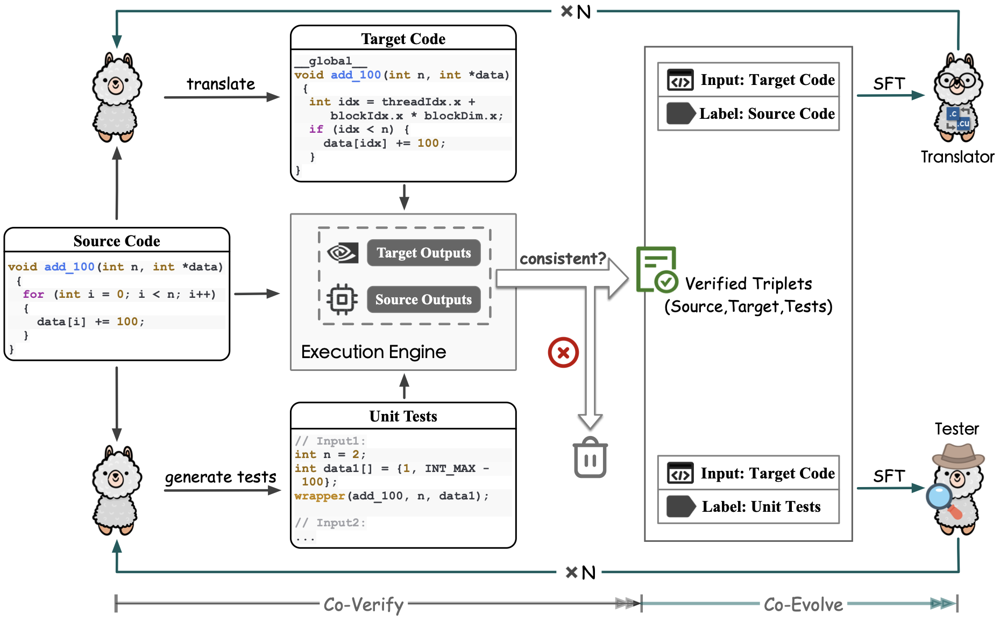
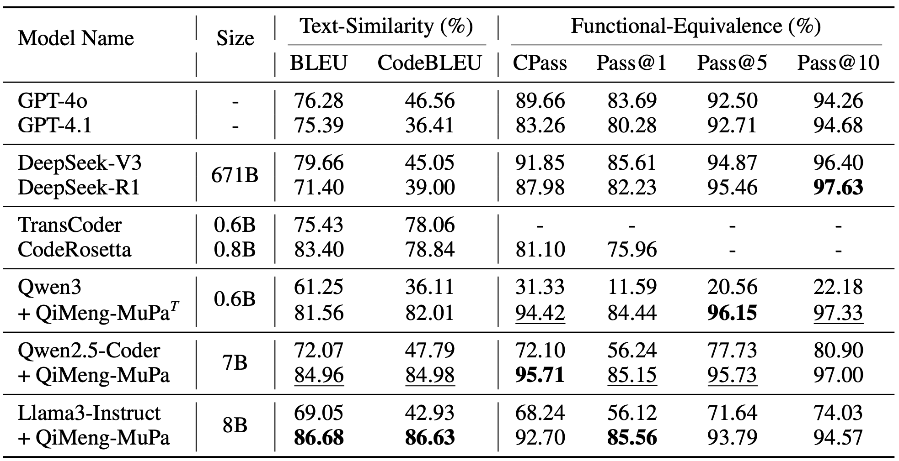
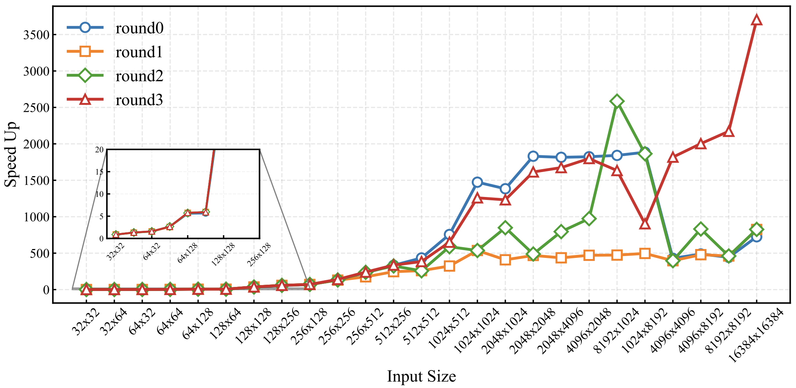

<h2 align="center">
  QiMeng-MuPa: Mutual-Supervised Learning for Sequential-to-Parallel Code Translation
</h2>

<p align="center">
  <a href="https://arxiv.org/abs/2506.11153">
    
  </a>
  &nbsp;&nbsp;
  <a href="https://huggingface.co/collections/kcxain/qimeng-mupa">
    
  </a>
</p>

This is the public release of the official implementation for the paper [QiMeng-MuPa: Mutual-Supervised Learning for Sequential-to-Parallel Code Translation](https://arxiv.org/abs/2506.11153).

Please note that this repository is still under active development. We will release the end-to-end training and evaluation code in the near future. If you have any questions regarding the paper or the code, feel free to contact us at kcxain@gmail.com. We will get back to you as soon as possible.

## ✨ Updates
- **[2025-09]** - QiMeng-MuPa has been accepted to **NeurIPS 2025** 🎉
- **[2025-08]** - We have released [Qwen3-0.6B-translator](https://huggingface.co/kcxain/translator-Qwen3-0.6B), welcome to try!


## Methods

### QiMeng-MuPa framework

<p align="center">
  
</p>

### Main results

#### Correctness

<p align="center">
  
</p>

#### Speed Up of translated code

<p align="center">
  
</p>


## Quick Start

### Install
We recommend installing the dependencies using uv or pip.
We have provided a uv.lock file to ensure a fully reproducible environment.

```bash
uv sync
```
or
```bash
pip install -e .
```

### Structure

- Original/filtered data: `BabelTower/dataset`
- Test set with unit test: `resources/unit_total_eval_cases.jsonl`
- A unified framework for inference `models/base`
- Codebase for co-verify `unit_test`
- Codebase for co-evolve `trans`

### Usage

#### Co-verify

```bash
bash scripts/build_sft.sh
```
This script will use vllm to inference and apply co-verify to build the sft data for code translation and unit test generation.

#### Co-evolve

We use llama-factory for fine-tuning.
```bash
git clone https://github.com/hiyouga/LLaMA-Factory
```
You can register the dataset from Co-verify step and fine-tune the model according to the llama-factory docs.

#### Evaluate Pass@k

```bash
bash scripts/eval_pass_k.sh
```

## Citation

```bibtex
@article{ke2025mupa,
    title={QiMeng-MuPa: Mutual-Supervised Learning for Sequential-to-Parallel Code Translation}, 
    author={Changxin Ke and Rui Zhang and Shuo Wang and Li Ding and Guangli Li and Yuanbo Wen and Shuoming Zhang and Ruiyuan Xu and Jin Qin and Jiaming Guo and Chenxi Wang and Ling Li and Qi Guo and Yunji Chen},
    journal={arXiv preprint arxiv:2506.11153},
    year={2025},
    url={https://arxiv.org/abs/2506.11153}, 
}
```
